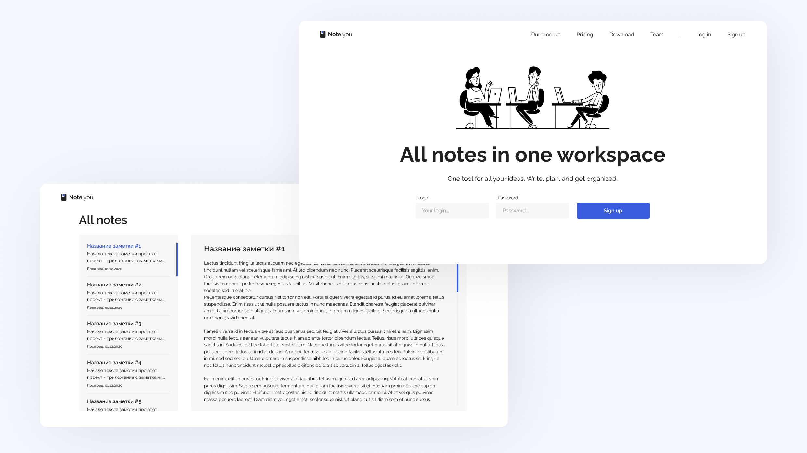
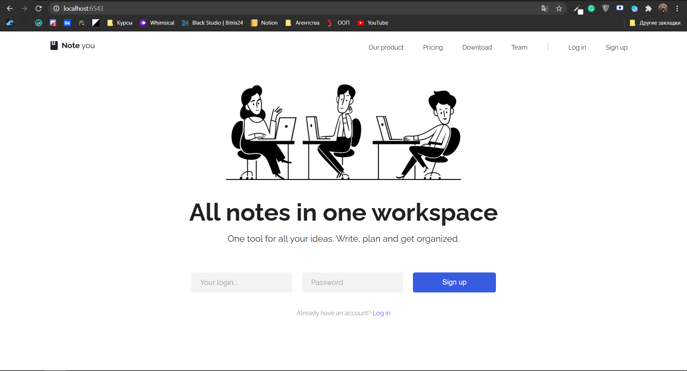
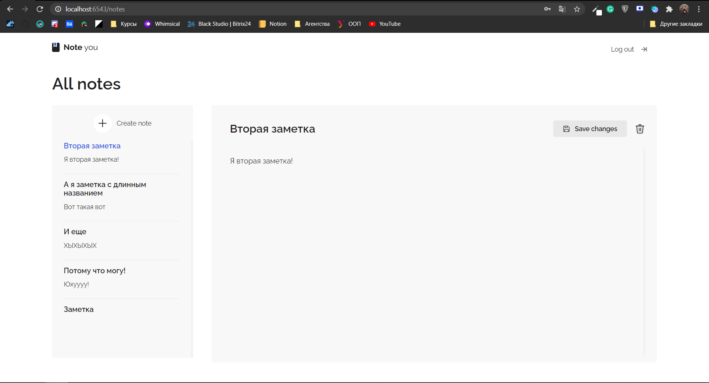
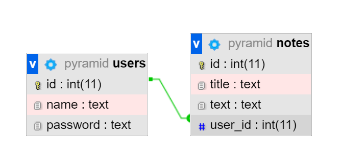

# Note You! Веб-приложение заметок
Учебный проект по Web-программированию в УрФУ с использованием HTML, CSS, AJAX, Pyramid, MySQL

#### Тема проекта: Веб-приложение заметок
#### Команда: Глухов Антон (РИ-380022), Лисов Данил (РИ-380014)
#### Задача проекта: В целях обучения необходимо создать веб-приложение с использованием фреймворка Pyramid и других средств веб-разработки.

## Оглавление
[1. Установка и запуск проекта](https://github.com/doublecoding/noteyou_app#%D0%B7%D0%B0%D0%B4%D0%B0%D1%87%D0%B0-%D0%BF%D1%80%D0%BE%D0%B5%D0%BA%D1%82%D0%B0)

[2. О проекте](https://github.com/doublecoding/noteyou_app#%D0%B7%D0%B0%D0%B4%D0%B0%D1%87%D0%B0-%D0%BF%D1%80%D0%BE%D0%B5%D0%BA%D1%82%D0%B0)

____
## 1. Установка и запуск проекта
1. Скачайте проект любым удобным способом с данного репозитория и распакуйте при необходимости
2. Откройте терминал и перейдите в директорию, куда был скачан проект
3. С помощью следующей команды установите проект:
```
python setup.py install
```
4. Откройте проект в IDE и подключите базу данных в файле models.py на 8-ой строчке. Если используется OpenServer, то можно оставить без изменений
5. Запустите проект через терминал следующей командой:
```
pserve production.ini
```
> Данный метод запуска проекта проверен на Windows

____
## 2. О проекте
#### Идея
Ежедневно оба участника нашей команды используют приложения для заметок. Это может быть полезно в учёбе, когда нужно срочно записать важную информацию с лекций или на работе, когда нужно составить техническое задание для команды разработки. Так как данный тип приложения нам знаком, мы решили реализовать именно его.
____
#### Реализованный функционал
:white_check_mark: Регистрация и авторизация

:white_check_mark: Добавление, чтение, редактирование и удаление заметок в текстовом формате


#### Стэк технологий
- HTML с шаблонизатором Jinja2
- CSS
- JS + AJAX
- MySQL + SQLAlchemy
____
### Этапы разработки
#### Дизайн
На этом этапе был разработан полноценный дизайн нашего будущего приложения. В качестве основного цвета был выбран нейтральный синий цвет и классические черный с белым. Интерфейс интуитивен, что позволяет пользователю удобно использовать наше приложение. Ниже представлен макет приложения, созданный в Figma.



#### Верстка
На этом этапе была создана HTML разметка и написаны стили для проекта. Версткой занимались оба участника команды.
Ниже представлены скриншоты верстки приложения в браузере.




#### Создание и подключение БД
В качестве базы данных мы использовали MySQL, а для удобного взаимодействия с ней использовалась популярная библиотека SQLAlchemy. Для работы с MySQL мы использовали готовое ПО OpenServer. Схема БД представлена ниже.



#### Backend
После того, как была создана модель базы данных, мы начали разработки внутренней части проекта. Мы создали CRUD-функции для заметок, основные функции для отображения страниц, а так же функции для входа и регистрации в приложении. Всего получилось девять функций для @view_config. Так же в отдельном файле routes.py были созданы все роуты. Параллельно с этим мы перевели HTML-файлы в Jinja2, что позволило нам отделить верстку и логическую часть, т.е. отображать изменяемые данные на визуальной части приложения. AJAX в свою очередь позволил нам обращаться к серверу без перезагрузки страницы. Именно благодаря ему работает удаление и редактирование без обновления страницы.

#### Итоги работы
Мы смогли полностью реализовать все задуманные функции нашего веб-приложения с нуля. Приложение работает так как задумано и, что не маловажно, выглядит точно так же как и на макете. В ходе курса мы смогли изучить основы веб-разработки, верстку, фреймворк pyramid, а так же AJAX. 


